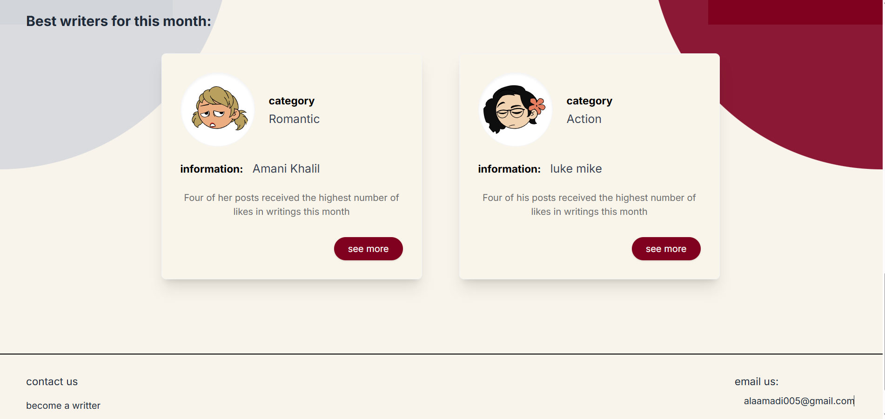

# 📚 Libraree - Read and Share Books Community

Libraree is a comprehensive online community platform designed for both readers and writers. It allows users to discover new books across various categories, read stories, and publish their own writings to build an audience.

## � Showcase & Tutorial
Check out this video tutorial of the website in action:
[Watch the Video Tutorial](https://drive.google.com/file/d/1CY_3zxNvnkKnRO2amOs3wDxZ4GvC5GM5/view?usp=sharing)

### Screenshots




## �🌟 Key Features
### 📖 For Readers (Reading Portal)
* **Discover Books:** Browse a wide collection of books categorized into Technology, Science, Romantic, History, Business, and Literature.
* **Category Filtering:** Easily filter the book grid by specific categories to find exactly what you're looking for.
* **Performance Optimized:** Enjoy fast loading times thanks to lazy-loaded book covers and writer avatars.

### ✍️ For Writers (Publisher Hub)
* **Publishing Dashboard:** A dedicated space for writers to manage their posts and stories.
* **Add New Book:** A streamlined `publish.html` form interface to publish new books, complete with title, category selection, and description fields. 
* **Interactive Feedback:** Asynchronous submission process with loading states (e.g., "جاري النشر...") to provide clear visual feedback during the publishing flow.

### 🔐 Authentication & Portal
* **Sign Up / Sign In:** A unified Modal for user authentication.
* **Choice Portal:** After logging in, users are greeted with a beautiful portal to choose their primary role for the session: "Read" or "Publish".

### 🎨 Design & UI
* **Responsive Layout:** fully responsive design that works seamlessly on desktop and mobile devices.
* **Tailwind CSS & Cairo Font:** Utilizes Tailwind CSS for rapid, modern styling, paired with the beautiful 'Cairo' and 'Inter' fonts for typography.
* **React Integration:** Uses React (via CDN) within the main `index.html` to manage complex UI states (like the Auth Modal, Choice Portal, and Book Filtering) interactively.

---

## 🛠️ Technology Stack
* **Frontend Structure:** HTML5
* **Styling:** CSS3 & Tailwind CSS (via CDN)
* **Interactivity:** React (18), ReactDOM, and Babel (via CDN)
* **Icons:** FontAwesome (v6.4.0) & Lucide Icons
* **Backend / Database:** [Supabase](https://supabase.com/) (JS SDK included)

---

## 🚀 Getting Started

Since the project is built using HTML, CSS, and client-side JavaScript (React), you don't need a complex build step to run it locally.

### Prerequisites
* A modern web browser (Chrome, Firefox, Safari, Edge).
* (Optional) A local development server like VS Code's "Live Server" extension for a better experience.

### Local Installation
1. Clone or download the repository.
2. Ensure you are in the `libraree` folder where the HTML files are located:
   ```
   ├── index.html     # Main landing page, reading portal, and publisher hub
   ├── publish.html   # Dedicated form page for publishing new books
   ├── package.json   # Project metadata (if applicable)
   └── README.md      # This documentation file
   ```
3. Open `index.html` in your web browser. (If using VS Code, right-click `index.html` and select "Open with Live Server").

---

## 🗄️ Database Configuration (Supabase)

Currently, the application uses **Mock Data** and simulated asynchronous requests for the "Read" and "Publish" flows. To connect the application to a real Supabase database, follow these steps:

### 1. Setup Supabase
1. Create a new project on [Supabase.com](https://supabase.com/).
2. Go to **Project Settings -> API** to get your `Project URL` and `anon public key`.

### 2. Create the Database Table
Create a table named `books` in your Supabase SQL editor with the following structure:
```sql
create table books (
  id bigint primary key generated always as identity,
  title text not null,
  author text, 
  category text not null,
  description text,
  cover text,
  created_at timestamp with time zone default timezone('utc'::text, now()) not null
);
```

### 3. Connect the Frontend
Locate the Database Setup stub in both `index.html` (inside the `<script type="text/babel">` tag) and `publish.html` (inside the `<script>` tag).

**Uncomment and update lines with your actual keys:**
```javascript
// Replace with your actual Supabase URL and Key
const supabaseUrl = 'https://YOUR_PROJECT_ID.supabase.co';
const supabaseKey = 'YOUR_ANON_PUBLIC_KEY';
const supabase = supabase.createClient(supabaseUrl, supabaseKey);
```

**Inside `index.html` (ReadingSection Component):**
Replace the `setTimeout` mock inside the `useEffect` with the real fetch call:
```javascript
useEffect(() => {
  const fetchBooks = async () => {
    const { data, error } = await supabase.from('books').select('*');
    if (!error) {
       setBooks(data);
    } else {
       console.error("Error fetching books:", error);
    }
    setLoading(false);
  };
  fetchBooks();
}, []);
```

**Inside `publish.html` (Form Submit Listener):**
Replace the `setTimeout` network simulation with the real insert call:
```javascript
// Replace the simulated promise with:
const { data, error } = await supabase.from('books').insert([
    { title: title, category: category, description: description }
]);
if (error) throw error;
```

---

## 🧪 QA & Testing Results
* **Performance:** Image loading has been optimized using the `loading="lazy"` attribute, reducing initial page load times and saving bandwidth.
* **User Flows:** The "Read" and "Publish" pathways have been fully verified with interactive loading states, preventing duplicate submissions, and ensuring smooth navigation between the Portal and the specific Hubs.

---

*Built with ❤️ for the love of reading and writing.*
